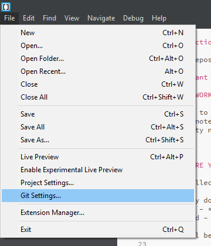
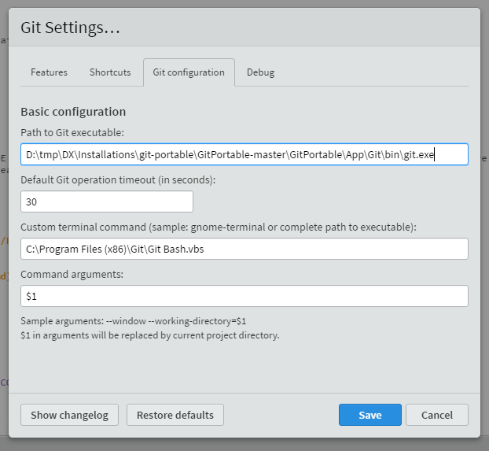
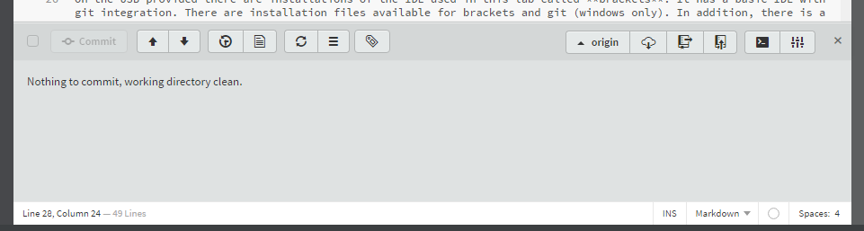

## Installing Brackets

On the USB provided there are installations of the IDE used in this lab called **brackets**. It has a basic IDE with git integration. There are installation files available for brackets and git (windows only).

In addition, there is a portable version of brackets. Follow the next steps if you want to use the portable version.

### **STEP 1:** Install Brackets (portable)

- Install brackets `BracketsPortable_Release_1.8_English.paf.exe` in the `Installations\Brackets` directory. You can also download the portable version of Brackets from (https://github.com/sagiegurari/brackets-portable)

### **STEP 2:** Install Git (portable)

- Install brackets `PortableGit-2.12.0-64-bit.7z.exe` in the `Installations\Git` directory. You can also download the portable version of Git from (https://github.com/sheabunge/GitPortable)

### **STEP 3:** Start Brackets

- Start `BracketsPortable.exe` where you installed Brackets

### **STEP 4:** Configure git

- Open the Git Settings menu (under File)

    

- Configure the path to git to be full path including the filename `git.exe`.
    eg. `D:\projects\DX-portable\git-portable\bin\git.exe`

    

    After restarting brackets, it should look like this.
    
    

Return to the Main Page to start the labs [README.md](README.md)