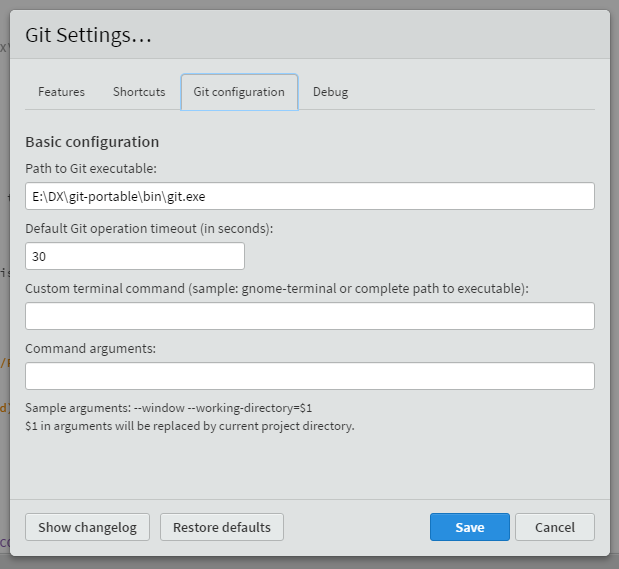

# Introduction #

This is repository that contains labs material for Speed To Value Developer Experience Workshop.

## Important to verify before you start ##

##### NETWORK SETTINGS

+ Connect to the **WIFI** network called clear-guest. You will need to open a browser and then connect to http://www.oracle.com. From there, authenticate with guest as the username and use the supplied password.
+ Please note that only a subset of ports are accessible through this network. Through practice 22/80/443/7001 are accessible. Anything else is block. If you need to access a different port, please connect through a third-party network.

----

### BEFORE YOU START

Please collect following data - we will use these details during the labs so please collect following:

+ Identity domain
+ User(s) - *cloud.admin*
+ Password - belongs to *cloud.admin* 

These will be provided by your instructor.

#### Brackets ####

On the USB provided there are installations of the IDE used in this lab called **brackets**. It has a basic IDE with git integration. There are installation files available for brackets and git (windows only).

In addition, there is a portable version of brackets. Follow the next steps if you want to use the portable version.

##### **STEP 1:** Unzip DX-portable.zip

- Unzip the `DX-portable.zip` file in the current directory.

##### **STEP 1:** Start Brackets

- You can find the portable version of brackets in `DX-portable\brackets-portable` directory.

- Start `BracketsPortable.exe`

##### **STEP 2:** Configure git

- Open the Git Settings menu (under File)

    

- Configure the path to git to be full path including the filename.
    eg. `D:\projects\DX-portable\git-portable\bin\git.exe`

    

    After restarting brackets, it should look like this.
    
    

----
### Lab 1 ###
+ [Create a simple micro-service](cloud-native-devops/README.md)

### Lab 2 ###
+ [Create a simple online application](stack/README.md)

### Lab 3 ### *** IN-PROGRESS
+ [Create a workflow application](pcs/README.md)

---

## [Contributing](CONTRIBUTING.md)
Pull Requests are currently not being accepted. See [CONTRIBUTING](CONTRIBUTING.md) for details.

## [License](LICENSE.md)
Copyright (c) 2014, 2017 Oracle and/or its affiliates
The Universal Permissive License (UPL), Version 1.0
