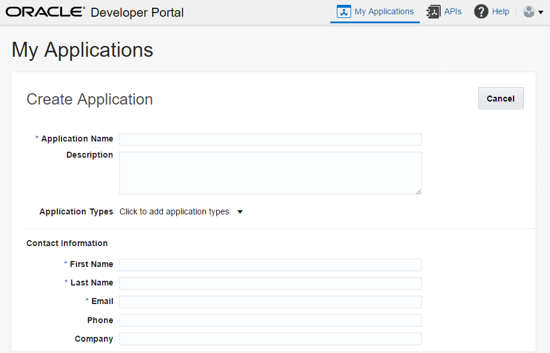

## Introduction

This is one of the labs that are part of the **Developer Experience workshop.** This workshop will walk you through the API Developer persona as part of the API Economy.

You will take on 3 Personas during the workshop. During this workshop you will take on the role of 3 personae. As the first persona - the API Developer - you will create the API and the documentation.  As the second persona - the API Manager - you will deploy the The Project Manager will manage access to register and consume the APIs and deploy the API. As the final final persona - the APP Developer (the one building the end product) - you will define a new application, register the API against teh application and finally consume it. All of these activities demonstrate the capability of API Platform Cloud Service.

In this lab, you will be the **APP Developer**.

## Objectives

- Create an application (defining it in API Platform Cloud Service)
- Register the API
- Test the API (using Postman)

## Required Artifacts
- The following lab requires API Platform Cloud Service access that will be supplied by your instructor.
- The following lab requires access to the Tweeter Feed Microservice developed as part of Lab 1.

# Consume Twitter Feed API

## Consume a New API

### **STEP 1**: Login to your API Platform Cloud Service account

- From any browser, go to the API PCS (Developer) URL provided by your instructor:
    eg. `https://api.oracle.com/developers`

    

- Enter your User Name and Password and click **Sign In**

  **NOTE:** For this lab you will assume the role of API ***John Dunbar***. Although you are assuming the identify of John Dunbar, you will log into the account using the **username** provided to you by your instructor. As you progress through the workshop, you will remain logged in as a single user, but you will make “logical” changes from John Dunbar the APP Developer to other personas.

    

    

### **STEP 2**: Create a new application

    

    

    

### **STEP 3**: Register API with the newly created application

    

    

    
	
	Note the application key. This will be used and passed as an HTTP header in the request.

## Test the new API

### **STEP 4**: Test the API

- From any browser, go to the API URL. Use the API Gateway details provided by the instructor.
    eg. `https://apigw.oracle.com/<your API uri>`

    

- Need to open a REST client ie Postman, go to the API URL. Use the API Gateway details provided by the instructor and add a HTTP header apikey with the value from Step 3.
    eg. `https://apigw.oracle.com/<your API uri>`

    

- You are now ready to move to the next lab.
