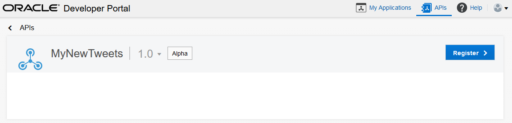

## Introduction

This is one of the labs that are part of the **Developer Experience workshop.** This workshop will walk you through the API Developer persona as part of the API Economy.

You will take on 3 Personas during the workshop. During this workshop you will take on the role of 3 personae. As the first persona - the API Developer - you will create the API and the documentation.  As the second persona - the API Manager - you will deploy the The Project Manager will manage access to register and consume the APIs and deploy the API. As the final final persona - the APP Developer (the one building the end product) - you will define a new application, register the API against teh application and finally consume it. All of these activities demonstrate the capability of API Platform Cloud Service.

In this lab, you will be the **APP Developer**.

## Objectives

- Create an application (defining it in API Platform Cloud Service)
- Register the API
- Test the API (using Postman)

## Required Artifacts
- The following lab requires API Platform Cloud Service access that will be supplied by your instructor.
- The following lab requires access to the Tweeter Feed Microservice developed as part of Lab 1.

# Consume Twitter Feed API

### **This section of the lab is executed by the Application Developer Persona**

## Consume a New API

### **STEP 1**: Login to the Developer Portal with your API Platform Cloud Service account

- From any browser, go to the API PCS (Developer) URL provided by your instructor:
    eg. `https://api.oracle.com/developers`

    

- Enter your User Name and Password and click **Sign In**

    

### **STEP 2**: Create a new application

- You will be creating a new application to consume the API. First we need to focus on creating a new application. Click on the **My Applications** tab at the top of the page.

    

- Create a new application. Click on the **New Application** button.
	
    

- Complete the details of new application. Click on the **Apply** button (at the bottom).
	
    

	After creating the application, you will see the newly created application.
	
    

### **STEP 3**: Register API with the newly created application

- You will be now registering the application to use the API. Click on the **APIs** tab at the top of the page.

    

- Hover over the API you created (it will highlight). Click on the API name.

    

- Click on the **Register** button.

    

- Select on the `Application` that you created.

    
	
	Note the application key. This will be used and passed as an HTTP header in the request.
	
	And then click **Register API** button.

## Test the new API

### **STEP 4**: Test the API

- From any browser, go to the API URL. Use the API Gateway details provided by the instructor.
    eg. `https://apigw.oracle.com/<your API uri>`

    

- If you use Google, use an application like Postman (a REST client), go to the API URL. Use the API Gateway details provided by the instructor and add a HTTP header **apikey** with the value from Step 3.
    eg. `https://apigw.oracle.com/<your API uri>`

    

- If you use Firefox, use an application like REST Easy or RESTED (another REST client), go to the API URL. Use the API Gateway details provided by the instructor and add a HTTP header **apikey** with the value from Step 3.
    eg. `https://apigw.oracle.com/<your API uri>`

    

- You are now ready to move to the next lab.

Return to [Lab 1.2](README.md) to continue the labs.