## Introduction

This is one of the labs that are part of the **Developer Experience workshop.** This workshop will walk you through the API Developer persona as part of the API Economy.

You will take on 3 Personas during the workshop. During this workshop you will take on the role of 3 personae. As the first persona - the API Developer - you will create the API and the documentation.  As the second persona - the API Manager - you will deploy the The Project Manager will manage access to register and consume the APIs and deploy the API. As the final final persona - the APP Developer (the one building the end product) - you will define a new application, register the API against teh application and finally consume it. All of these activities demonstrate the capability of API Platform Cloud Service.

In this lab, you will be the **API Developer**.

## Objectives

- Create API (itself)
    - Define the API policy flows
- Create API documentation
    - And publish it

## Required Artifacts
- The following lab requires API Platform Cloud Service access that will be supplied by your instructor.
- The following lab requires access to the Tweeter Feed Microservice developed as part of Lab 1.

# Create Twitter Feed API

## Create a New API

### **STEP 1**: Login to your API Platform Cloud Service account

- From any browser, go to the API PCS (Manageer) URL provided by your instructor:
    eg. `https://api.oracle.com/apiplatform`

    

- Enter your User Name and Password and click **Sign In**

  **NOTE:** For this lab you will assume the role of API ***Bala Gupta***. Although you are assuming the identify of Bala Gupta, you will log into the account using the **username** provided to you by your instructor. As you progress through the workshop, you will remain logged in as a single user, but you will make “logical” changes from Bala Gupta the API Developer to other personas.

    

    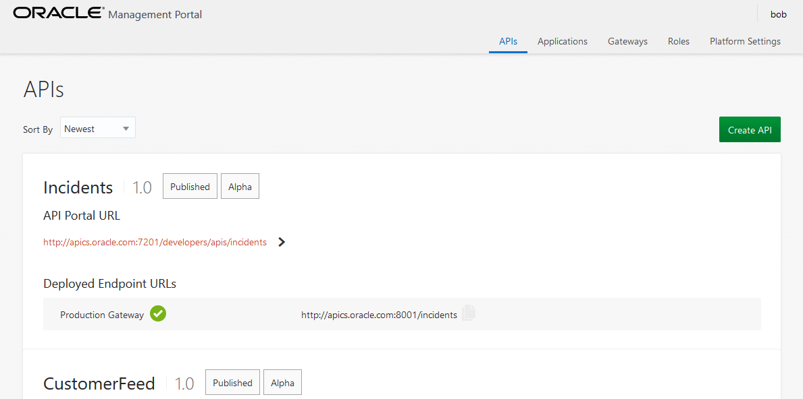
	
### **STEP 2**: Create a new API

- You will be presented with a list of current APIs. We'll be creating a new one. Click on the **Create API** button.

    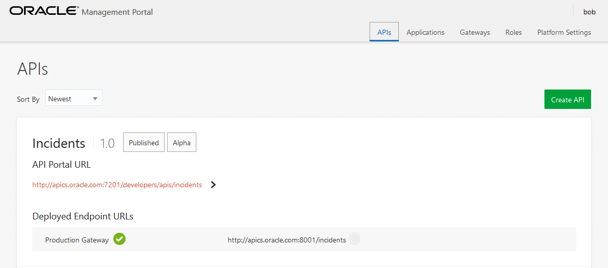

- Complete the details of the API. The following details.

	**Name:** `CustomerFeed_<Initials>`
		- Please use your initials in the name to denote your API. (This is a common environment).
	**Version:** `1.0`
	**Description:** `This is my new API - <Name>`
		- Please put your name in the API description.

    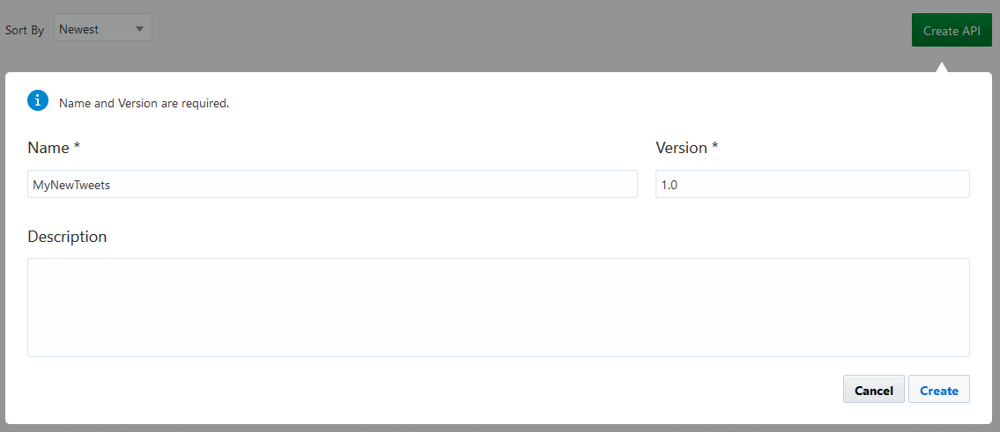
	
	After creating the API, there will be a new API listed. You will also notice that its staged as `Alpha`.

    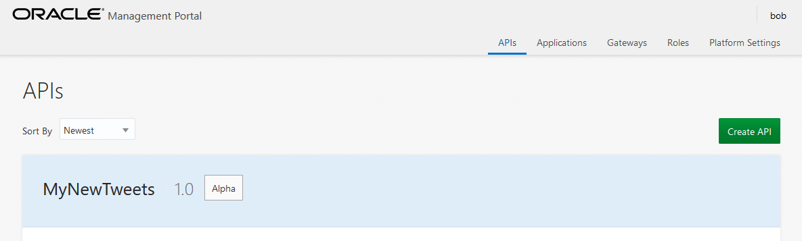
	
### **STEP 3**: Configure the API Policy Flow

- Hover over the API you created (it will highlight). Click on the API name. This will open up the API details (configuration and runtime details). Note that down the left-hand side, there are icons reflecting the tabs to configure the API. We'll go through some of these tabs.

- Hover over the area called `API Request`. Click on the **Edit** button. This will edit this policy. Note that the policy outline is dotted. This means that the policy is in draft mode and not complete.

    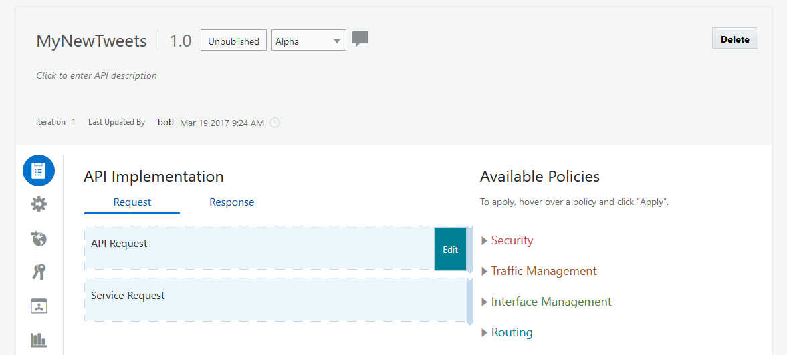

- Review the details of `API Request` policy. Click on the **Next** button.

    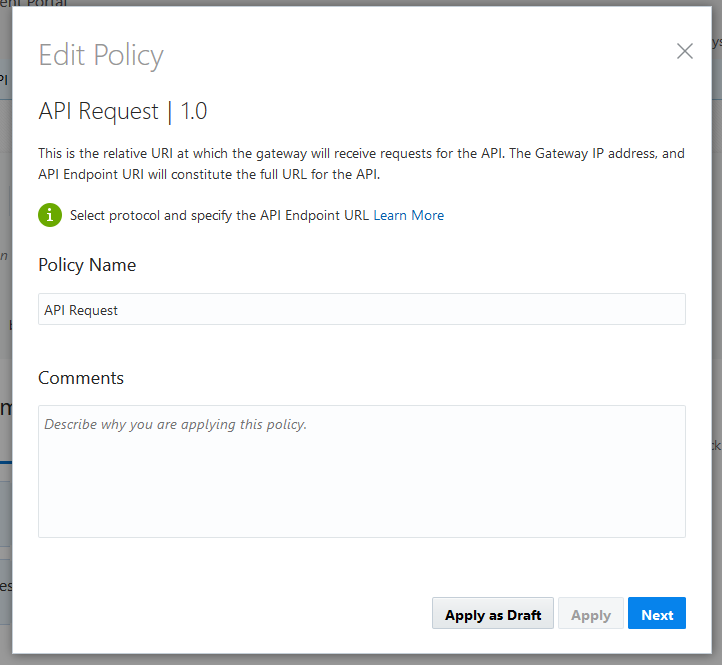

- Complete the configuration details of the `API Request`. Then click on the **Apply** button.

	**API Endpoint URL:** `myfeed_<Initials>`
		- Please use your initials in the name to denote your API. (This is a common environment).

	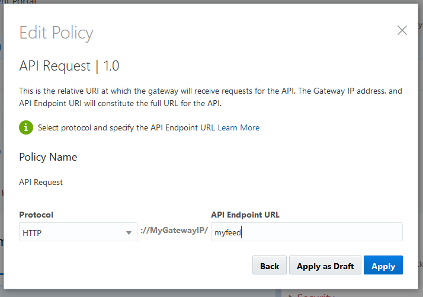

	After applying the change, you will be taken back to the main API configuration page. Note that the outline of `API Request` policy is now solid meaning that it is complete. Note: that there is another policy `Service Request` that needs to be configured.

	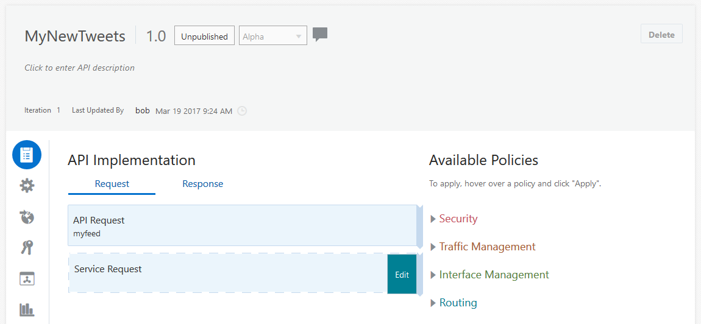

- Hover over the area called `Service Request`. Click on the **Edit** button. This will edit this policy. Similar to the previous policy. Review the details and click on the **Next** button.

	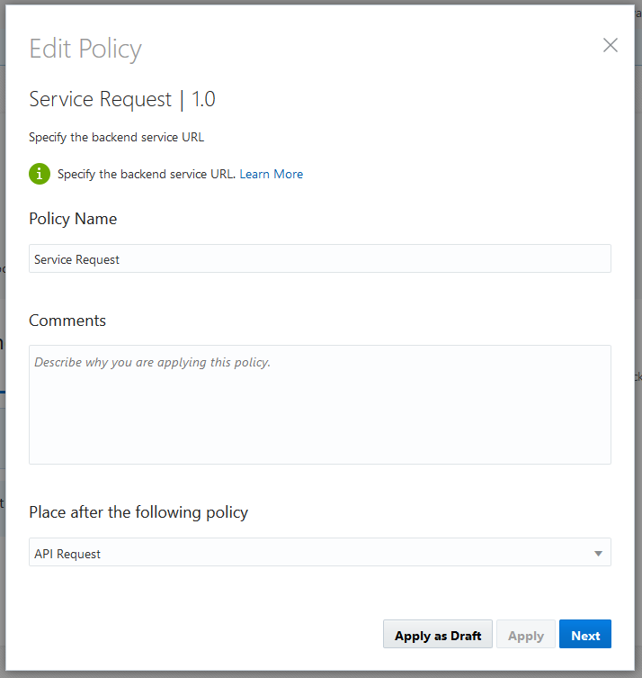

- Complete the configuration details of the `Service Request`. Then click on the **Apply** button.

	**Backend Service URL:** `<my tweeter feed URL from previous lab>`
		- Please use your tweeter feed API that you created. If you have any questions on finding this API, ask your instructor.

	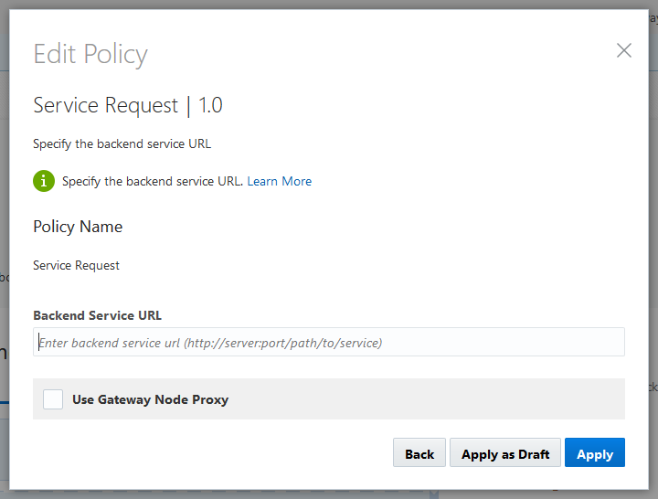

- Expand `Security` policies under the list of `Available Policies`.

	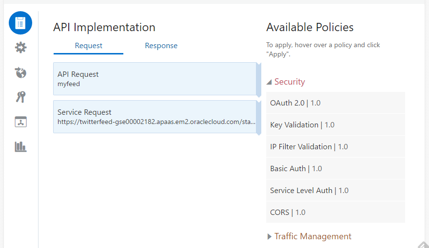

- Hover over `Key Validation` policy and click on the **Apply** button.

	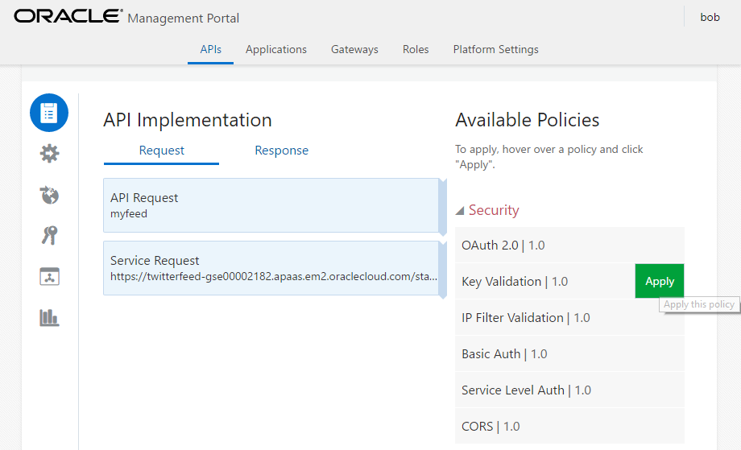

- Review and click on the **Next** button.

	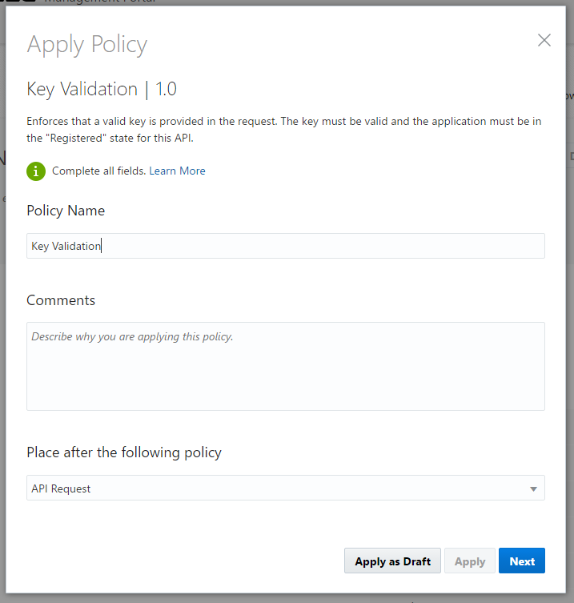

- Complete the configuration details of the `Key Validation` policy and then click on the `Apply` button.

	**Key Delivery Method:** Query Header

	**Key Header:** `apikey`

	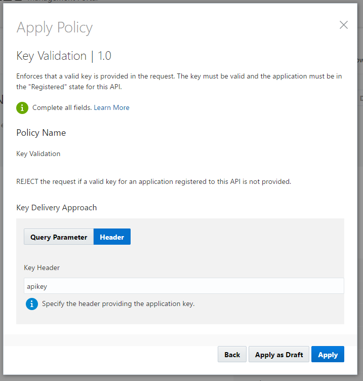
	
	After applying the change, you will be taken back to the main API configuration page. Note that the `Key Validation` policy is now included in the API implementation.
	
	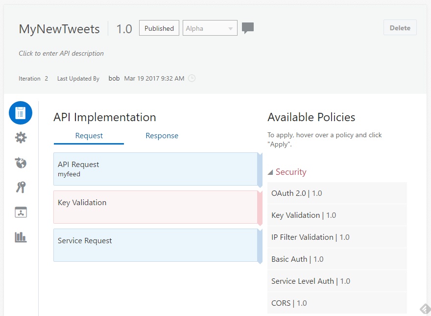	
	
- You will see that at the top of the main API configuration page, that there is status of `Changes have been made to this API`. Click **Save Changes** to `save the changes`.

	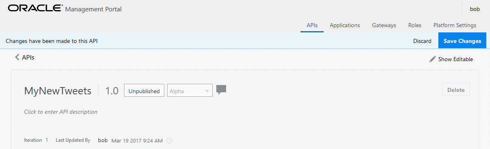

### **STEP 3**: Publish the API Documentation

  **NOTE:** We will now publish some documentation that will be used by the `APP Developer`. This is important to the whole developer experience. Since this is how an APP developer learns how to use the API. Also, it's a method to help the APP developer through testing framework and sample request / responses.

- Click on the **Publication** icon (third from the top - ie. the `world with an arrow`)

	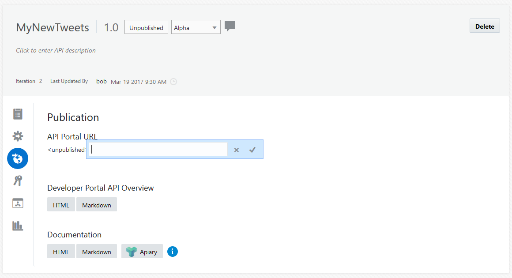

- Click on the `portal name` of the API Portal URL of which it will open a editor to type in the name. Click on the `tick` to complete editing.

	**Portal URL:** `myfeed_<Initials>`
		- Please use your initials in the name to denote your API. (This is a common environment).

	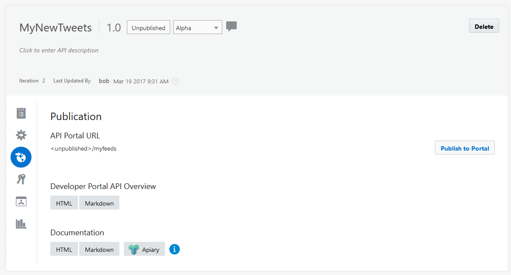

- Add content to both `Developer Portal API Overview` and `Documentation`. Note that this will add content that is viewing by the APP Developer.

- Click on the **Publish to Portal** button.

- You are now ready to move to the next lab.
