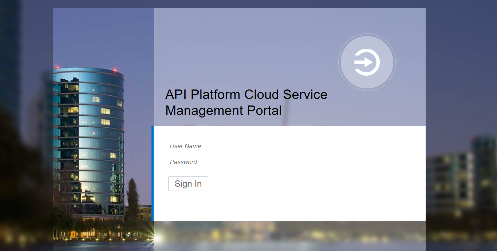
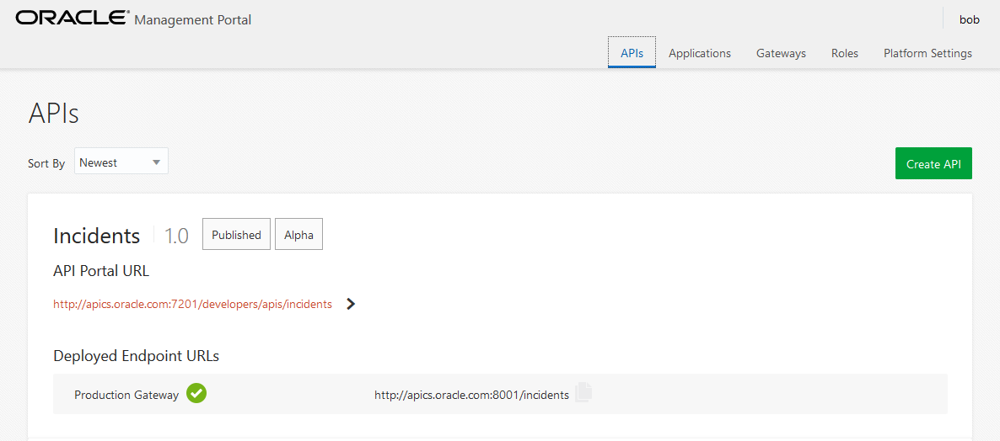

## Introduction

This is one of the labs that are part of the **Developer Experience workshop.** This workshop will walk you through the API Developer persona as part of the API Economy.

You will take on 3 Personas during the workshop. During this workshop you will take on the role of 3 personae. As the first persona - the API Developer - you will create the API and the documentation.  As the second persona - the API Manager - you will deploy the The Project Manager will manage access to register and consume the APIs and deploy the API. As the final final persona - the APP Developer (the one building the end product) - you will define a new application, register the API against teh application and finally consume it. All of these activities demonstrate the capability of API Platform Cloud Service.

In this lab, you will be the **API Manager**.

## Objectives

- Grant access privileges to manage the API
- Deploy the API

## Required Artifacts
- The following lab requires API Platform Cloud Service access that will be supplied by your instructor.
- The following lab requires access to the Tweeter Feed Microservice developed as part of Lab 1.

# Manage Twitter Feed API

## Grant Access To API

### **STEP 1**: Login to your API Platform Cloud Service account (if you haven't already)

- From any browser, go to the API PCS (Manageer) URL provided by your instructor:
    eg. `https://api.oracle.com/apiplatform`

    

- Enter your User Name and Password and click **Sign In**

  **NOTE:** For this lab you will assume the role of API ***Lisa Jones***. Although you are assuming the identify of Lisa Jones, you will log into the account using the **username** provided to you by your instructor. As you progress through the workshop, you will remain logged in as a single user, but you will make “logical” changes from Lisa Jones the API Manager to other personas.

    

    
	
### **STEP 2**: Select API for you to manage (if you haven't already)

- Hover over the API you created (it will highlight). Double-click on the API. This will open up the API details (configuration and runtime details). Note that down the left-hand side, there are icons reflecting the tabs to configure the API. We'll go through some of these tabs.

    
	
### **STEP 2**: Select API for you to manage (if you haven't already)

- Hover over the API you created (it will highlight). Double-click on the API. This will open up the API details (configuration and runtime details). Note that down the left-hand side, there are icons reflecting the tabs to configure the API. We'll go through some of these tabs.

    
	
### **STEP 3**: Configure access to manage API

- Click on the **Grant Access** icon (fourth from the top - ie. the `set of keys`)

    

- Click on the **Register** button

    

- Click on the **Add Grantee** button

    

- Scroll down the list and select `Name` called `APPDevelopers` and click on the **Add** button.

    
	
	This will bring you back to the list of users and groups that have access to `Register` the API.
	
    	

### **STEP 4**: Deploy the API

- Click on the **Deployments** icon (second from the top - ie. the `cog with an arrow in the middle`)

    

- Click on the **Deploy API** button.

    

- Select the gateway called `Production Gateway` and add a description. And then click on the **Deploy** button.

    

	Note that this will bring you back to the `Deployments` tab and you will see the being deployed. Initially, you might see the count of `Waiting` APIs as `not zero`. This means that APIs are being deployed or undeployed. Eventually, the API will be deployed ready for testing.

- You are now ready to move to the next lab.

Return to [README.md](Lab 1.2) to continue the labs.