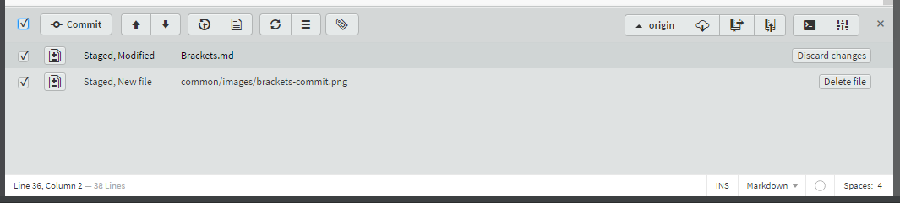

## Installing Brackets

On the USB provided there are installations of the IDE used in this lab called **brackets**. It has a basic IDE with git integration. There are installation files available for brackets and git (windows only).

In addition, there is a portable version of brackets. Follow the next steps if you want to use the portable version.

### **STEP 1:** Install Brackets (portable)

- Install brackets `BracketsPortable_Release_1.8_English.paf.exe` in the `Installations\Brackets` directory. You can also download the portable version of Brackets from (https://github.com/sagiegurari/brackets-portable)

### **STEP 2:** Install Git (portable)

- Install brackets `PortableGit-2.12.0-64-bit.7z.exe` in the `Installations\Git` directory. You can also download the portable version of Git from (https://github.com/sheabunge/GitPortable)

### **STEP 3:** Start Brackets

- Start `BracketsPortable.exe` where you installed Brackets

### **STEP 4:** Install Git Plugin

- Open the Extensions Manager

    

- Search for and install "Brackets Git Plugin"

    

### **STEP 5:** Configure git

- Open the Git Settings menu (under File)

    

- Configure the path to git to be full path including the filename `git.exe`.
    eg. `D:\projects\DX-portable\git-portable\bin\git.exe`

    

    After restarting brackets, it should look like this.
    
    

## Example Walkthroughs

**THESE ARE EXAMPLES FOR REFERENCE ONLY**

These are examples of how to Brackets with Git. Please ensure you follow the instructions as per the labs. You can use this section as a guide to navigate the IDE.

### Clone Repository - To download the code (from a new folder)

- In Windows Explorer, create a new directory (this is where the code will be downloaded to)

- In Brackets, click on the `File` menu and click `Open Folder`. Select the newly created directory.

    

- Click on the `Clone` button.

    

- Add in the dx-labs git repository URL `https://github.com/barackd222/dx-labs` and clone.

    

### Commit Changes - To save the changes locally

- In Brackets, you can see the changes to the local files.

    

- Select the files you want to commit.

    

- Add the comments to the commit.

    

### Push Changes - To synchronise the remote repository from the local repository

- In Brackets, click on the `Push Repository` button.

    

- Use the default settings (and if required add your username and password to the details)

    

### Pull Changes - To synchronise the local repository from the remote repository

- In Brackets, click on the `Pull Repository` button.

    

- Use the default settings (and if required add your username and password to the details)

    

Return to the Main Page to start the labs [CloudNative300.md](CloudNative300.md)