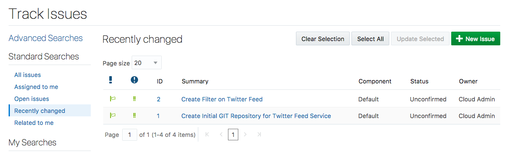
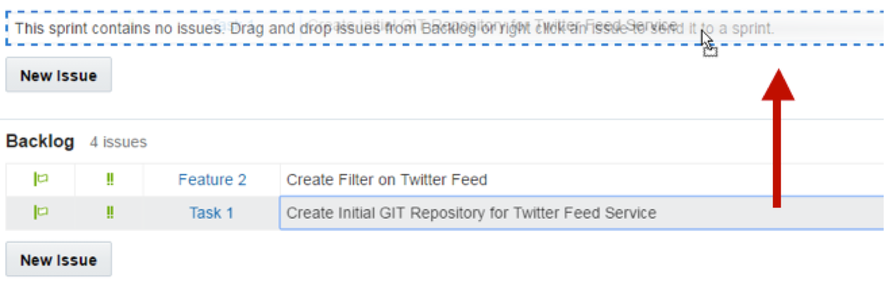
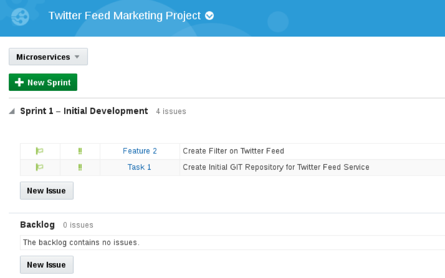
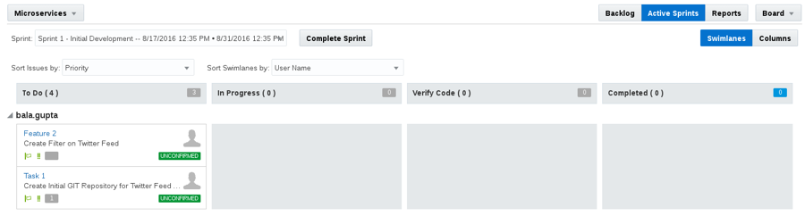

## Introduction

This is the first of several labs that are part of the **Developer Experience workshop.** This workshop will walk you through the Software Development Lifecycle (SDLC) for a Cloud Native project that will create and use several Microservices.

You will take on 3 Personas during the workshop. The **Project Manager Persona** will create the projects, add tasks and features to be worked on, and assign tasks to developers.  The Project Manager will then start the initial sprint. The Java Developer persona will develop a new twitter feed service that will allow for retrieval and filtering of twitter data. The **JavaScript Developer** persona will develop a new Twitter Marketing UI that will display the twitter data to allow for analysis.  During the workshop, you will get exposure to Oracle Developer Cloud Service and Oracle Application Container Cloud Service.

## Objectives
- Create Initial Project
    - Add Users to Project
- Create Product Issues
    - Create Issues for Twitter Feed Marketing UI
- Create Agile Board and initial Sprint
- Add Issues to Sprint

## Required Artifacts
- The following lab requires an Oracle Public Cloud account that will be supplied by your instructor.

# Create Twitter Feed Marketing Project

## Create Developer Cloud Service Project

### **STEP 1 (Option 1)**: Login to your Oracle Cloud Account

**IF YOU ARE USING YOUR OWN ENVIRONMENT AND YOU DO NOT HAVE A LINK TO DEVELOPER CLOUD - PLEASE FOLLOW THESE MORE DETAILED INSTRUCTIONS BEFORE CONTINUING THIS LAB [CloudLogin.md](CloudLogin.md)**

### **STEP 1 (Option 2)**: Login directly to Developer Cloud Service

- From any browser, go to the URL provided by your instructor. It should look something like:
    `https://developer.em2.oraclecloud.com/developer12345-iddomain1234`

- Enter your identity domain and click **Go**.

    **NOTE:** The **Identity Domain, User Name** and **Password** values will be given to you by the instructor.

    

- Once your Identity Domain is set, enter your User Name and Password and click **Sign In**

  **NOTE:** For this lab you will assume the role of Project Manager ***Lisa Jones***. Although you are assuming the identify of Lisa Jones, you will log into the account using the **username** provided to you by your instructor, given to you by your corporation, or supplied to you as part of an Oracle Trial. As you progress through the workshop, you will remain logged in as a single user, but you will make “logical” changes from Lisa Jones the Project Manager to other personas.

    

    

### **STEP 2**: Create Developer Cloud Service Project

- Click **New Project** to start the project create wizard.

    

- On Details screen enter the following data and click on **Next**.

    **Name:** `Twitter Feed Marketing Project`

    **Description:** `Project to gather and analyze twitter data`

    **Note:** A Private project will only be seen by you. A Shared project will be seen by all Developer Cloud users. In either case, users need to be added to a project in order to interact with the project.

    

- Leave default template set to **Empty Project** and click **Next**

    

- Select your **Wiki Markup** preference to **MARKDOWN** and click **Finish**.

    

- The Project Creation will take about 1 minute.

    

- You now have a new project, in which you can manage your software development.

    

**IF THIS FAILS, THEN YOU MAY NEED TO DELETE A PREVIOUS PROJECT. ASK YOUR INSTRUCTOR FOR ASSISTANCE**

# Create Product Issues

## Create Issues for Twitter Feed Microservice

### **STEP 3**: Create Issue for initial GIT Repository creation

- Click **New Issue**. Enter the following data in the New Issue page and click **Create Issue**. Note: The next two issues will logically be owned by John Dunbar.

    

    **Summary:** `Create Initial GIT Repository for Twitter Feed Marketing UI`

    **Description:** `Create Initial GIT Repository for Twitter Feed Marketing UI`

    **Type:** `Task`

    **Owner:** `Select your account provided in the dropdown [Logical Owner: John Dunbar]`

    **Story Points:** `1`

    

### **STEP 4**: Create Issue for Displaying Twitter Feed

- Click **New Issue**. Enter the following data in the New Issue page and click **Create Issue**.

    

    **Summary:** `Display Twitter Feed in Table Format`

    **Description:** `Display Twitter Feed in Table Format`

    **Type:** `Feature`

    **Owner:** `Select account provided in the dropdown [Logical Owner: John Dunbar]`

    **Story Points:** `2`

    

- Click the back arrow on the **left side** of the window, or click on the **Issues** menu option to view all newly created issues.

    

# Create Agile Board

## Create Agile Board and Initial Sprint

### Developer Cloud Service Agile Page Overview

Before you start using the Agile methodology in Oracle Developer Cloud Service, it is important that you know the following key components of the Agile page.

- **Board** – A Board is used to display and update issues of the project. When you create a Board, you associate it with an Issue Query. The Board shows Issues returned by the Query.
You can either use a Board created by a team member, or create your own Board. You can create as many Boards as you like.
- **Sprint** – A Sprint is a short duration (usually, a week or two) during which your team members try to implement a product component.
You add the product component related issues to a Sprint. When you start working on a product component, you start (or activate) the related Sprints. To update issues using a Sprint, you must first activate the Sprint and add the Sprint to the Active Sprints view.
- **Backlog view** – Lists all Issues returned by the Board’s Query. The view also displays all active and inactive Sprints of the Board, and the sprints from other Boards that contain Issues matching the Board’s Query.
Each Sprint lists issues that are added to it. The Backlog section (the last section of the Backlog page) lists all open issues that are not part of any Sprint yet. The Backlog view does not show the resolved and closed Issues.
- **Active Sprints view** – Lists all active Sprints of the Board and enables you to update an Issue status simply by dragging and dropping it to the respective status columns.
- **Reports view** – select the Burndown Chart tab to display the amount of work left to do in a Sprint or use the Sprint Report tab to list open and completed Issues of a Sprint.

### **STEP 5**: Create Agile Board

- Click **Agile** on the Left Side Menu to display a page listing all existing Boards

    

- Click **New Board** and enter the following data. When done click **Create**.

  **Name:** `Microservices`

  **Estimation:** `Story Points`

    

### **STEP 6**: Create Sprint
- We will now create our first Sprint. Click **New Sprint**. Enter the following data and click **OK.**

    **Name:** `Sprint 1 - Initial Development`

    **Story Points:** `6`

    

### **STEP 7**:	Add Backlog Issues to Sprint

- Next, we want to add the backlog issues to the newly created spring. **Drag and drop** the **2 issues** one at a time upward onto the **Sprint 1** section. This will add the issues to the sprint.

    

    

## Customize Agile Board

### **STEP 8**: Customize Board

In the following step you will customize an Agile Board, and add a new Progress State. If you desire more information about States and Conditions, the following link will provide a tutorial: http://www.oracle.com/webfolder/technetwork/tutorials/obe/cloud/developer/AgileDevelopment/AgileDevelopment.html

- Now we will show you how you can customize your board. In the right hand side click **Board -> Configure**

    

  **Note**: Before we create a new progress state, we want to un-assign some of the conditions that will be used in the new state. You can’t add new conditions or remove conditions, however, you can redefine progress states to suit your project’s needs and move conditions from one state to another. A large number of conditions are assigned to the Completed state by default.

- Click on **Progress States** then click **Completed** state. In the lower left panel of the window, scroll down the conditions and select all the **RESOLVED conditions**.  Click  to move them over to Unassigned Conditions panel

    

- Click **New Progress State**.  Change **Name** to **Verify Code**. We will use this new State for performing QA and Testing.

    

- Highlight all the **RESOLVED** unassigned conditions, and click  to move them over to the Conditions column.

    

- With **Verify Code** highlighted, click  to move **Verify Code** above the Completed Process State.

    

- Click **Save** to persist change.

    

### **STEP 9**: Start Sprint

- Click the **Start Sprint** button.

- Leave the defaults and click **Start**

    

- Now click on **Active Sprints** to view the Sprint Dashboard

    

- Click on the **Reports** button to view the Burndown and Sprint reports.

    

- You are now ready to move to the next lab.

Return to [Lab 1.2](CloudNative200.md) to continue the labs.