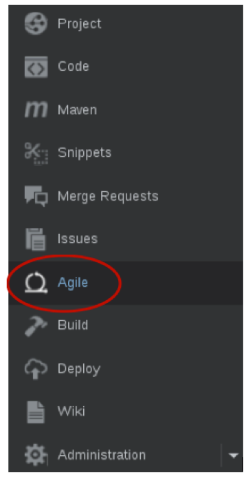
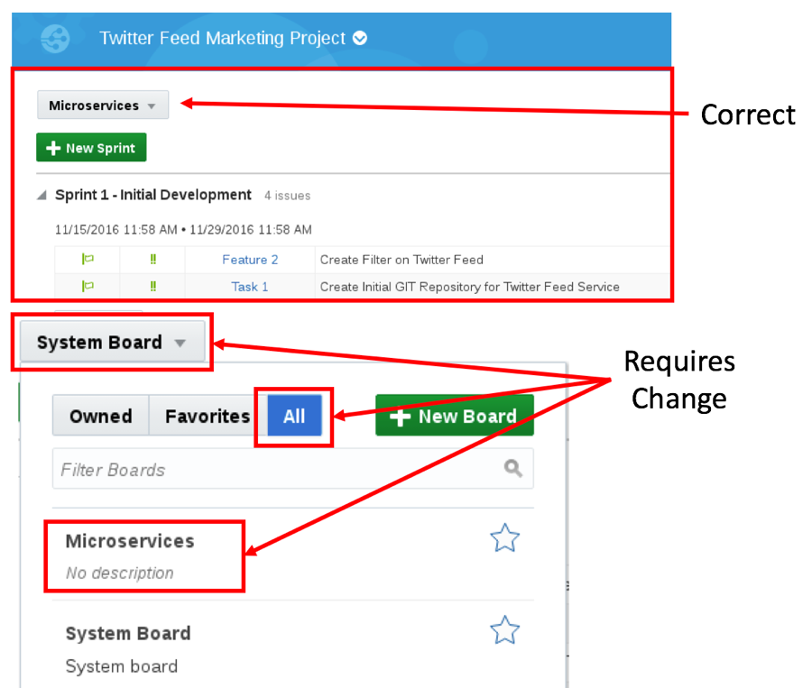
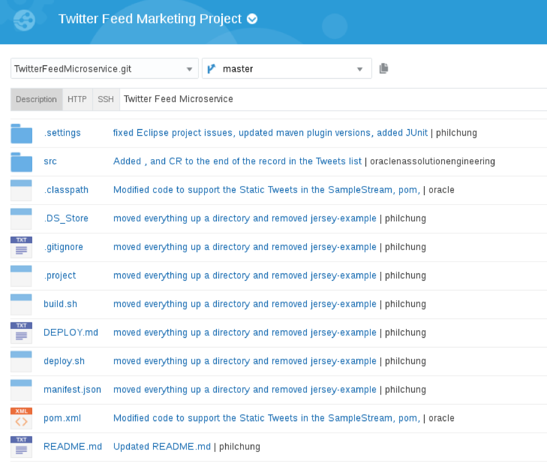
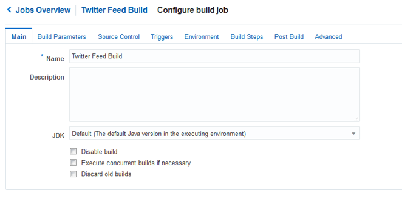
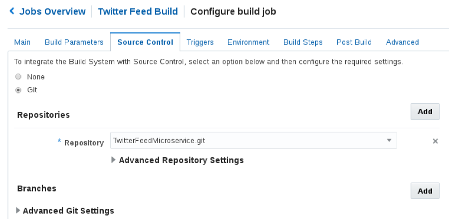
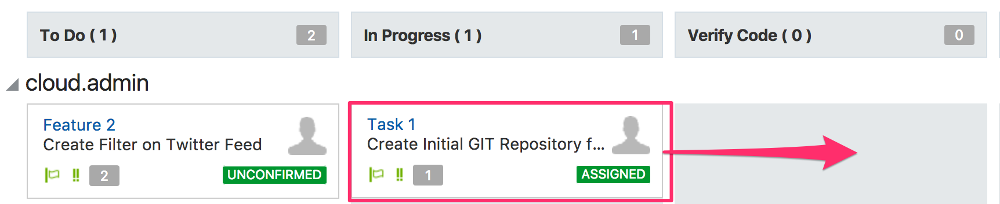
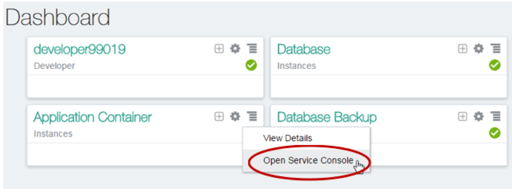

## Introduction

This is the second of several labs that are part of the **Developer Experience workshop.** This workshop will walk you through the Software Development Lifecycle (SDLC) for a Cloud Native project that will create and use several Microservices.

In the previous lab, the Project Manager created a new project in the Developer Cloud Service and created and assigned tasks to the developers of this application. In this lab you will assume the persona of the Java developer, who will be tasked with creating several microservices that will supply data to any front-end or analytics applications.

## Objectives

- Access Developer Cloud Service
- Import Code from external Git Repository
- Build and Deploy project using Developer Cloud Service and Oracle Application Container Cloud Service

## Required Artifacts

- The following lab requires an Oracle Public Cloud account that will be supplied by your instructor.

# Create Initial Static Twitter Feed Service (as Java Developer Persona)

## Explore Developer Cloud Service

### **STEP 1**: Review Agile Board

- This Lab assumes that you just completed Lab 100 and are still connected to the Oracle Cloud, that you're still in the Developer cloud Service Dashboard, and you're viewing the "Twitter Feed Marketing Project". If for some reason that is not the case, follow the first several steps of Lab 100 to once again view the Developer Cloud Service Console.

      

- Although you will remain connected to the Oracle Cloud using the user account you were provided, you will take on the Jave Developer Persona as you perform the following steps.

- Within the **Twitter Feed Marketing Project**, click on **Agile** found on the left hand navigation.

      

### **STEP 2**: Show Microservices Board

- If the **Microservices** list is not displayed as shown below, then click on the **Board Dropdown**, select **All**, and click on **Microservices**.

      

### **STEP 3**: Display the Active Sprint

- On the **Microservices** Board, click **Active Sprints**

      

## Create Initial Git Repository

### **STEP 4**: Create Initial Git Repository

To begin development on our Twitter feed microservices, we could start coding from scratch. However, prior to the formal kickoff of this project, you (as Bala Gupta) have already started doing some proof-of-concept development outside of the Developer Cloud Service in order to assess the feasibility of your assignment. You want to bring that existing code into the Developer Cloud Service as a starting point for your microservices. You will do that by cloning your external GIT repository into the Developer Cloud Service. Your first step will be to accept your task using the agile board.

- Drag and drop **Task1 - Create Initial GIT Repository for Twitter Feed Service** into the **In Progress** swim-lane.  

      

- Click on **Next** in the Change Progress popup.

      

- In the **Add Time Spent** popup, enter `1` in the **Time Spent** field, and Click **OK**.

      

- Your Sprint progress will appear as shown below.

      

- In the left hand navigation panel, click **Project**

- On the right side under **REPOSITORIES** click on **New Repository** to create a new Git Repository.

      

- In the New Repository wizard enter the following information and click **Create**.

    **Name:** `TwitterFeedMicroservice`

    **Description:** `Twitter Feed Microservice`

    **Initial content:** `Import existing repository`

    **Enter the URL:** `https://github.com/pcdavies/TwitterFeed.git`

      

- You have now created a new GIT repository based on an existing repository.

      

## Create Default Build and Deployment Process

### **STEP 5**: Create Default Build Process

Now that we have the source code in our managed GIT repository, we need to create a build process that will be triggered whenever a commit is made to the master branch. We will set up a Maven build process in this section.

- On navigation panel, click **Build** to access the build page and click **New Job**.

      

- In the New Job popup enter `Twitter Feed Build` for the Job Name, and then click **Save**.

      

- You are now placed into the job configuration screen.

      

- On the Main tab of the Configure Build screen change the **JDK** drop down to **JDK8**.

      

- Click the **Source Control** tab.

- Click **Git** and select the **TwitterFeedMicroservice.git** from the drop down.

      

- Click the **Triggers** tab.

  **Select**: `Based on SCM polling schedule`

      

- Click the **Build Steps** tab. Click **Add Build Step**, and select **Invoke Maven 3**.

      

- Change **Goals** to `clean assembly:assembly`

      

- Click the **Post Build** tab and complete the following:
  - Check **Archive the artifacts**.
  - Enter `**/target/*` for **Files to Archive**.  
  - Verify **GZIP** in the Compression Type.
  - Check **Publish JUnit test report**
  - Enter `**/target/surefire-reports/*.xml` for the Test Report XMLs. This will provide a report on the Test Scripts results for each build.

      

- Click **Save** to complete the configuration.

- Click the **Build Now** button to start the build immediately. Wait, as it may take 30 seconds or more, but the status will change to the following:

      

  **NOTE:** Once the build begins, it should take about approximately 1 to 2 minutes for the build to complete. Once complete, you will be able to see the number of successful test runs in the Test Result Trend section. Wait for the build to complete before continuing to the next step, as we need the build artifact to complete the deployment configuration.

- After the build begins, you can also click on the **Console Icon** to monitor the build log details.

      

### **STEP 6**: Create Default Deployment Process

Now that we have successfully built our project, we need to create a deployment configuration that will watch for stable builds and deploy them to a new Application Container Cloud Service instance for testing.

- On the navigation panel click **Deploy** to access the Deployment page. Click **New Configuration**.

      

- Enter the following data:

  **Configuration Name**: `TwitterFeedMicroserviceDeploy`

  **Application Name**: `JavaTwitterMicroservice`

      

- To the Right of Deployment Target, click **New** and select **Application Container Cloud**

      

- Enter the following data:

  - **Data Center**: `<Your Assigned Datacenter>` ***(Ask instructor if needed)***

  - **Identity Domain**: `<Your Identity Domain>`

  - **Username**: `<Your User Name>`

  - **Password**: `<Supplied Password>`

- Click **Test Connection**. If Successful, click **Use Connection**:

      

- Set the following Properties as follows:

  - **Runtime**: `Java`

  - **Subscription**: `Hourly`

  - **Type:** `Automatic` and `Deploy stable builds only`

  - **Job:** `Twitter Feed Build`

  - **Artifact:** `target/twitter-microservice-example-dist.zip`

      

- Click **Save**

      

- Click the gear drop down and select **Start**

      

- Wait until the message **Starting application** changes to **Last deployment succeeded**

      

      

## Verify Twitter Feed Microservice deployment

### **STEP 7**: Change status to Verified

Now that we have successfully deployed the build artifact to the Application Container Cloud Service, we will update our agile board to reflect that status. Although the complexity of the next task (verification) is quite simple, we will still move the task to the “Verify Code” column before manually verifying the new functionality.

- On navigation panel click **Agile**, followed by clicking **Active Sprints**. Drag and drop **Task 1** from **In Progress** to the **Verify Code** column.

      

- In the Change Progress pop up, click on **Next**

      

- In the **Add Time Spent** popup, set the **Time Spent** to `1` and click **OK**

      

- The code is now ready for verification before moving to Completed

      

### **STEP 8**: Login to Oracle Application Container Cloud Service 

- From the Oracle Public Cloud **Dashboard**, click on the  

     menu to the right of the **Application Container** service. Then select **Open Service** Console

      

- On the Application Container Cloud Service (ACCS) Service Console you can view all the deployed applications, including our newly created **JavaTwitterMicroservice**. Click on the **URL**, and it will load a new browser tab. Alternatively, copy and paste the URL into the address bar of a new browser tab.

      

- Append `/statictweets` to the end of the URL in the browser, and press return (e.g.):
`https://javatwittermicroservice-.apaas.em2.oraclecloud.com/statictweets`

    Note: The URL should return a JSON array containing a Static Twitter feed. Note: If you desire to see a formatted view of the JSON, and you are using Chrome, open a new tab and search Google for “JSONViewer chrome plugin” – After you install the Chrome Plugin and re-submit the URL, you will be able to view the JSON in a more readable format.

      

### **STEP 9**: Complete Task

We have now verified that the statictweets microservice has been deployed and functions properly. To finish up this part of the lab, we will mark the Issue as completed in the Sprint.

- Back in the Developer Cloud Service window, click **Agile**, followed by clicking Active Sprints.

- Drag and drop **Task 1** from **Verify Code** to **Completed**.

      

- In the Change Progress popup click **Next**.

      

- In the **Add Time Spent** popup, set the **Time Spent** to `1` and click **OK**.

      

- Your Sprint should now look like the following:

      

- You can also click on the **Reports** button and view your progress in the **Burndown Chart** and **Sprint Report**.

      

- You are now done with this lab.

Return to [Lab 1.3](../api/README.md) to continue the labs.